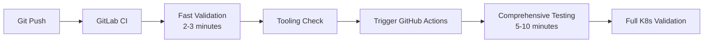

# Hybrid CI/CD Approach

OSDU-CI uses a **hybrid testing strategy** that combines GitLab CI and GitHub Actions for optimal development velocity and comprehensive validation.

## Overview



## GitLab CI (Fast Track)

**Duration**: 2-3 minutes  
**Purpose**: Quick feedback and development velocity

### What it tests:
- ✅ Project structure validation
- ✅ Makefile interface testing  
- ✅ Tool installation verification (kind, kubectl, helm, flux)
- ✅ Docker connectivity
- ✅ Basic file structure checks

### Jobs:
1. `validate-basic` - Project structure
2. `validate-tools` - Makefile interface
3. `test-tooling-validation` - Tool installation and connectivity
4. `trigger-github-actions` - Triggers comprehensive testing

## GitHub Actions (Comprehensive Track)

**Duration**: 5-10 minutes  
**Purpose**: Full Kubernetes and GitOps validation

### What it tests:
- 🔄 Complete Kind cluster creation
- 🔄 OSDU-CI full workflow (`make up`, `make deploy`, `make test`)
- 🔄 GitOps integration with Flux
- 🔄 MetalLB load balancer functionality
- 🔄 NGINX Ingress Controller
- 🔄 Application deployment (app1, app2, app3)
- 🔄 Connectivity and access testing
- 🔄 Multi-scenario validation

### Triggers:
- **Automatic**: Triggered by successful GitLab CI pipeline
- **Manual**: Can be triggered manually via GitHub Actions UI
- **Push**: Triggers on changes to `infra/`, `software/`, or workflow files

## Setup Instructions

### 1. GitLab CI Configuration

GitLab CI is automatically configured and runs on every push.

### 2. GitHub Actions Integration

To enable automatic triggering from GitLab CI:

1. **Create GitHub Personal Access Token**:
   - Go to GitHub Settings → Developer Settings → Personal Access Tokens
   - Generate token with `repo` and `workflow` scopes
   - Copy the token

2. **Configure GitLab CI Variable**:
   - Go to your GitLab project → Settings → CI/CD → Variables
   - Add variable: `GITHUB_TOKEN` with your GitHub token
   - Mark as Protected and Masked

3. **Verify Integration**:
   - Push a commit to trigger GitLab CI
   - Check that GitHub Actions workflow starts after GitLab CI completes

### 3. Manual Testing

You can also trigger comprehensive testing manually:

```bash
# Via GitHub Actions UI
Go to Actions → Comprehensive Kubernetes Testing → Run workflow

# Via GitHub CLI
gh workflow run comprehensive-k8s-testing.yml
```

## Benefits

### Fast Feedback Loop
- **2-3 minutes**: Get immediate feedback on basic validation
- **Early failure detection**: Catch configuration issues quickly
- **Development velocity**: Don't wait for full cluster tests during development

### Comprehensive Validation  
- **Full environment testing**: Complete Kubernetes cluster validation
- **GitOps integration**: Test Flux and application deployment
- **Real-world scenarios**: Test actual cluster networking and services

### Cost Optimization
- **GitLab CI**: Fast validation uses minimal compute resources
- **GitHub Actions**: Comprehensive testing only runs when needed
- **Parallel execution**: Both systems can run simultaneously

### Reliability
- **Redundancy**: Multiple CI systems reduce single point of failure
- **Specialized strengths**: Each system optimized for its purpose
- **Debugging**: Separate logs for different types of failures

## Monitoring and Debugging

### GitLab CI Logs
- Fast validation failures
- Tool installation issues
- Basic connectivity problems

### GitHub Actions Logs  
- Cluster creation failures
- Application deployment issues
- GitOps synchronization problems
- Network connectivity issues

### Status Indicators
- GitLab CI status shows fast validation results
- GitHub Actions status shows comprehensive testing results
- Both are visible in commit status checks

## Troubleshooting

### GitLab CI Failures
1. Check project structure and Makefile syntax
2. Verify tool installation URLs are accessible
3. Ensure Docker socket is available

### GitHub Actions Failures
1. Check cluster resource limits
2. Verify GitOps repository accessibility
3. Check network policies and timeouts
4. Review application deployment configurations

### Integration Issues
1. Verify `GITHUB_TOKEN` is configured in GitLab CI
2. Check GitHub repository permissions
3. Ensure repository dispatch events are enabled

## Future Enhancements

- **Status reporting**: GitHub Actions reporting back to GitLab
- **Artifact sharing**: Share test results between systems
- **Badge updates**: Automated README badge updates
- **Notifications**: Slack/email integration for comprehensive test results
- **Environment matrices**: Test multiple Kubernetes versions
- **Performance testing**: Load testing and benchmarking