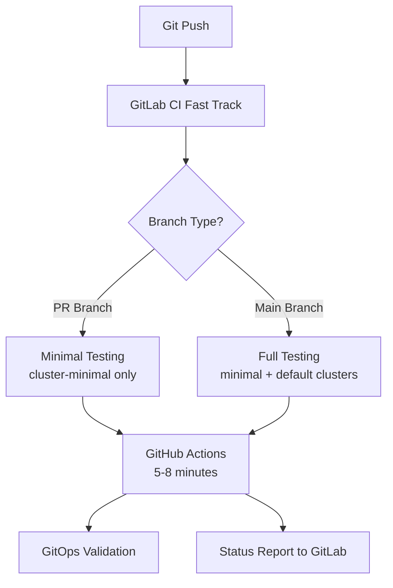

# Hybrid CI/CD Approach

OSDU-CI uses a **branch-aware hybrid testing strategy** that combines GitLab CI and GitHub Actions for optimal development velocity and comprehensive validation.

## Overview



## GitLab CI (Fast Track)

**Duration**: 2-3 minutes
**Purpose**: Quick feedback and development velocity

### What it tests:
- ✅ Project structure validation
- ✅ Makefile interface testing
- ✅ Tool installation verification (kind, kubectl, helm, flux)
- ✅ Docker connectivity
- ✅ Basic file structure checks

### Jobs:
1. `validate-basic` - Project structure
2. `validate-tools` - Makefile interface
3. `test-tooling-validation` - Tool installation and connectivity
4. `trigger-github-actions` - Triggers comprehensive testing

## GitHub Actions (Comprehensive Track)

**Duration**: 5-10 minutes
**Purpose**: Branch-aware Kubernetes and GitOps validation

### Branch-Specific Testing Strategy

#### PR Branches (Fast Validation)
- ✅ **cluster-minimal**: GitRepository source validation only
- ✅ **Duration**: ~5 minutes
- ✅ **Focus**: Flux installation, basic source reconciliation
- ❌ **Skips**: Full GitOps Kustomizations, application deployments

#### Main Branch (Full Validation)
- ✅ **cluster-minimal**: Basic Flux validation
- ✅ **cluster-default**: Complete GitOps testing with branch-specific sources
- ✅ **Duration**: ~8-10 minutes
- ✅ **Focus**: Full GitOps workflow with Kustomizations and application deployments

### What cluster-default tests:
- 🔄 Branch-specific GitRepository source creation (`osdu-ci-self`)
- 🔄 Complete Kustomization reconciliation
- 🔄 Application deployment from GitOps
- 🔄 MetalLB load balancer functionality
- 🔄 NGINX Ingress Controller
- 🔄 Multi-service app validation
- 🔄 GitOps status reporting and debugging

### Triggers:
- **Automatic**: Triggered by successful GitLab CI pipeline
- **Manual**: Can be triggered manually via GitHub Actions UI
- **Smart**: Only triggers on changes to `infra/`, `software/`, or workflow files

## Setup Instructions

### 1. GitLab CI Configuration

GitLab CI is automatically configured and runs on every push.

### 2. GitHub Actions Integration

To enable automatic triggering from GitLab CI:

1. **Create GitHub Personal Access Token**:
   - Go to GitHub Settings → Developer Settings → Personal Access Tokens
   - Generate token with `repo` and `workflow` scopes
   - Copy the token

2. **Configure GitLab CI Variable**:
   - Go to your GitLab project → Settings → CI/CD → Variables
   - Add variable: `GITHUB_TOKEN` with your GitHub token
   - Mark as Protected and Masked

3. **Verify Integration**:
   - Push a commit to trigger GitLab CI
   - Check that GitHub Actions workflow starts after GitLab CI completes

### 3. Manual Testing

You can also trigger comprehensive testing manually:

```bash
# Via GitHub Actions UI
Go to Actions → Comprehensive Kubernetes Testing → Run workflow

# Via GitHub CLI
gh workflow run comprehensive-k8s-testing.yml
```

## Benefits

### Fast Feedback Loop
- **2-3 minutes**: Get immediate feedback on basic validation
- **Early failure detection**: Catch configuration issues quickly
- **Development velocity**: Don't wait for full cluster tests during development

### Comprehensive Validation
- **Full environment testing**: Complete Kubernetes cluster validation
- **GitOps integration**: Test Flux and application deployment
- **Real-world scenarios**: Test actual cluster networking and services

### Cost Optimization
- **GitLab CI**: Fast validation uses minimal compute resources
- **GitHub Actions**: Comprehensive testing only runs when needed
- **Parallel execution**: Both systems can run simultaneously

### Reliability
- **Redundancy**: Multiple CI systems reduce single point of failure
- **Specialized strengths**: Each system optimized for its purpose
- **Debugging**: Separate logs for different types of failures

## Enhanced Logging and Debugging

### GitLab CI Logs
- Fast validation failures
- Tool installation issues
- Basic connectivity problems
- Branch sync status to GitHub

### GitHub Actions Enhanced Logging

#### cluster-minimal Logs
```bash
🎯 Test Scope: GitRepository Source Validation Only
===============================================
✅ Flux system installation: TESTED
✅ GitRepository source creation: TESTED
✅ Source reconciliation: TESTED
❌ Kustomizations: NOT APPLIED (intentional - this is a minimal smoke test)
❌ Application deployments: NOT TESTED
```

#### cluster-default Logs
```bash
🎯 GitOps Configuration Application Scope
=========================================
✅ Flux system installation: COMPLETED
✅ GitRepository source (osdu-ci-self): COMPLETED
⏳ Kustomizations: APPLYING NOW...

📦 Applying GitOps application configurations...
🔍 Files to be applied from software/stamp/apps:
   - software/stamp/apps/demo-app.yaml
📄 Applying: software/stamp/apps/demo-app.yaml

📊 Applied Kustomizations Summary:
================================
✅ Kustomization: apps (namespace: flux-system)
   GitRepository source: osdu-ci-self
   Path: ./software/stamp/clusters/osdu-ci
```

### Status Reporting
- **GitLab CI**: Shows fast validation and GitHub trigger status
- **GitHub Actions**: Reports comprehensive test results back to GitLab
- **Enhanced Debugging**: Detailed GitOps reconciliation status
- **Branch Awareness**: Different logging strategies for PR vs main branches

## Troubleshooting

### GitLab CI Failures
1. Check project structure and Makefile syntax
2. Verify tool installation URLs are accessible
3. Ensure Docker socket is available

### GitHub Actions Failures

#### cluster-minimal Issues
1. Flux installation failures (check CLI installation)
2. GitRepository source reconciliation timeout
3. Basic cluster connectivity problems

#### cluster-default Issues
1. GitRepository name mismatch (`osdu-ci-self` expected)
2. Kustomization reconciliation failures
3. Application deployment timeouts
4. MetalLB/Ingress configuration issues

#### Common Debugging Steps
```bash
# Check GitOps status
flux get all

# Check specific Kustomizations
kubectl get kustomizations -A

# Verify GitRepository sources
flux get sources git -A

# Check Flux logs
flux logs --follow
```

### Integration Issues
1. Verify `GITHUB_TOKEN` is configured in GitLab CI
2. Check GitHub repository permissions for repository dispatch
3. Ensure branch sync is working (check GitHub repo has correct branches)
4. Verify status reporting back to GitLab works

## Current Implementation Status ✅

- ✅ **Branch-aware testing**: PR vs main branch strategies
- ✅ **Enhanced logging**: Detailed GitOps reconciliation status
- ✅ **Status reporting**: GitHub Actions reports back to GitLab
- ✅ **GitOps validation**: Full Flux workflow testing
- ✅ **Smart triggering**: Only test when core files change

## Future Enhancements

- **Multi-environment testing**: Test against multiple K8s versions
- **Performance benchmarking**: Cluster startup and deployment timing
- **Security scanning**: RBAC and security policy validation
- **Badge automation**: Dynamic README badge updates
- **Slack integration**: Real-time notifications for test results
