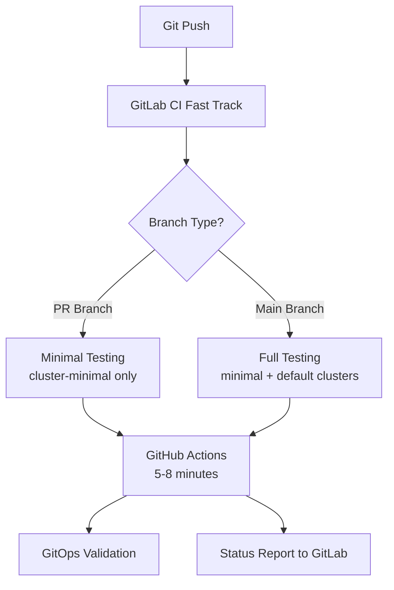

# ADR-005: Hybrid CI/CD Strategy

## Status
**Accepted** - 2025-01-20

## Context
HostK8s requires comprehensive testing of Kubernetes environments, GitOps reconciliation, and cross-platform compatibility. Single CI/CD platforms face trade-offs between speed (developer feedback) and thoroughness (comprehensive validation). We needed a strategy that provides fast feedback for development velocity while ensuring comprehensive testing for production readiness.

## Decision
Implement a **branch-aware hybrid CI/CD strategy** combining GitLab CI (fast track) with GitHub Actions (comprehensive track).

## Rationale
1. **Development Velocity**: GitLab CI provides 2-3 minute feedback for immediate development needs
2. **Comprehensive Testing**: GitHub Actions provides 8-10 minute full GitOps validation
3. **Branch Awareness**: PR branches get fast validation, main branch gets full testing
4. **Resource Optimization**: Avoid running expensive tests on every commit
5. **Best of Both Worlds**: Speed when needed, thoroughness when required

## Alternatives Considered

### 1. GitLab CI Only
- **Pros**: Single platform, familiar team workflow
- **Cons**: GitLab runners less suited for complex Kubernetes testing
- **Decision**: Rejected due to runner limitations and cost

### 2. GitHub Actions Only  
- **Pros**: Excellent Kubernetes tooling, powerful runners
- **Cons**: Slower startup times, less integrated with GitLab workflow
- **Decision**: Rejected due to development velocity impact

### 3. Jenkins/Self-Hosted
- **Pros**: Full control, unlimited resources
- **Cons**: Maintenance overhead, infrastructure complexity
- **Decision**: Rejected due to operational burden

## Implementation Architecture

### GitLab CI (Fast Track - 2-3 minutes)
- Project structure validation
- Makefile interface testing  
- Tool installation verification
- Docker connectivity
- Basic file structure checks

### GitHub Actions (Comprehensive Track - 8-10 minutes)
- **PR Branches**: cluster-minimal (GitRepository validation only)
- **Main Branch**: cluster-minimal + cluster-default (full GitOps testing)
- Complete Kubernetes cluster testing
- GitOps reconciliation validation
- Multi-environment testing

## Consequences

**Positive:**
- Fast developer feedback (2-3 minutes) maintains development velocity
- Comprehensive testing ensures production readiness
- Branch-aware testing optimizes resource usage
- Reduced false positives from over-testing feature branches
- Clear separation of concerns between platforms

**Negative:**
- Increased complexity managing two CI/CD platforms
- Potential synchronization issues between platforms
- Additional maintenance overhead for dual pipeline setup
- Learning curve for developers working with both systems

## Success Criteria
- ✅ PR feedback < 5 minutes for development velocity
- ✅ Main branch comprehensive testing < 12 minutes
- ✅ 95%+ test reliability across both platforms
- ✅ Clear status reporting back to GitLab
- ✅ Resource optimization: 60% reduction in unnecessary full testing

## Implementation Notes
- Branch detection logic in GitLab CI triggers appropriate GitHub Actions workflow
- GitHub Actions reports status back to GitLab for unified developer experience
- Smart triggering prevents unnecessary runs on documentation-only changes
- Enhanced logging shows exactly what's being tested in each track