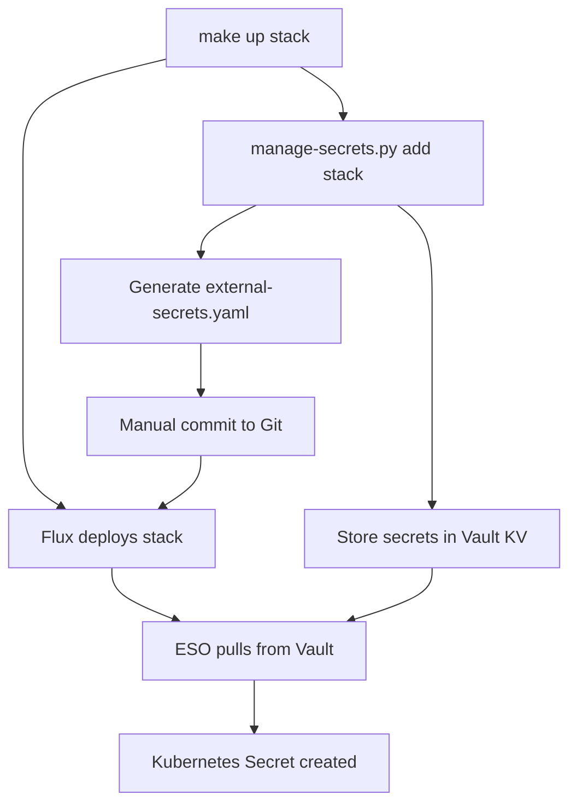

# ADR-014: Vault-Integrated Secret Management Architecture

## Context

ADR-013 established ephemeral secret management with direct Kubernetes secret generation, which successfully eliminated secrets from Git repositories and provided automatic provisioning. However, the implementation revealed a critical architectural flaw: **race conditions between Flux namespace creation and secret generation scripts**.

The original approach required scripts to wait for namespaces created by Flux, creating timing dependencies and operational fragility. Additionally, the direct secret generation pattern didn't align with modern GitOps principles where all cluster state should be declaratively managed.

## Decision

Evolve the secret management architecture to use **HashiCorp Vault + External Secrets Operator (ESO)** while preserving the successful SecretContract specification established in ADR-013.

**Enhanced Architecture:**
- **Vault as Secret Backend** - HashiCorp Vault (dev mode) stores generated secrets
- **External Secrets Operator** - Pulls secrets from Vault into Kubernetes declaratively
- **Preserved SecretContract** - Same `hostk8s.secrets.yaml` format for backward compatibility
- **GitOps Integration** - ExternalSecret manifests deployed via Flux eliminate race conditions
- **Enhanced Lifecycle** - Command-based interface (add/remove/list) for complete secret lifecycle management

**Key Components:**
1. **Vault Secret Storage** - Centralized secure storage with KV v2 engine
2. **Enhanced manage-secrets Scripts** - Store secrets in Vault + generate ExternalSecret manifests
3. **External Secrets Operator** - Syncs Vault secrets to Kubernetes automatically
4. **Vault UI Integration** - Development-friendly secret inspection via web interface
5. **Dependency Management** - Proper addon sequencing (NGINX → Vault → ESO)

## Rationale

**Why Vault + ESO vs Direct Generation:**
- **Race Condition Elimination**: ExternalSecrets deploy with namespaces via Flux, no timing dependencies
- **GitOps Alignment**: All Kubernetes resources managed declaratively through Git
- **Operational Visibility**: Vault UI provides development-friendly secret inspection
- **Modern Architecture**: Industry-standard pattern for secret management
- **Failure Resilience**: ESO automatically retries secret synchronization

**Why Preserve SecretContract Format:**
- **Backward Compatibility**: Existing stacks continue working unchanged
- **Developer Experience**: No learning curve for established contract format
- **Migration Path**: Smooth transition from ADR-013 implementation
- **Contract Validation**: Proven YAML schema and generation types

**Why Development-Mode Vault:**
- **Simplicity**: No external dependencies or complex authentication
- **Development Focus**: Optimized for local development workflows
- **Resource Efficiency**: Minimal overhead with dev-mode configuration
- **Security Appropriate**: Dev token acceptable for non-production environments

## Implementation

### Updated Architecture Flow



### Enhanced Secret Lifecycle

**Creation (make up):**
```bash
make up sample-app
├── manage-secrets.py add sample-app (called by Makefile)
│   ├── Parse hostk8s.secrets.yaml contract
│   ├── Store generated secrets in Vault
│   └── Generate manifests/external-secrets.yaml (manual commit required)
└── Flux deploys stack (including committed ExternalSecret manifests)
    └── ESO syncs Vault → Kubernetes secrets
```

**Removal (make down):**
```bash
make down sample-app
├── manage-secrets.py remove sample-app (called by Makefile)
│   └── Delete secrets from Vault
└── Flux removes stack resources (external-secrets.yaml remains committed)
```

### Vault Integration Pattern

**Vault Secret Storage:**
```bash
# Store in Vault KV v2 (path: stack/namespace/secret-name)
vault kv put secret/sample-app/sample-app/postgres-credentials \
  username=postgres \
  password=<generated> \
  host=voting-db-rw.sample-app.svc.cluster.local \
  port=5432
```

**ExternalSecret Manifest Generation:**
```yaml
# Generated external-secret.yaml (safe to commit)
apiVersion: external-secrets.io/v1
kind: ExternalSecret
metadata:
  name: postgres-credentials
  namespace: sample-app
spec:
  refreshInterval: 1h
  secretStoreRef:
    name: vault-backend
    kind: ClusterSecretStore
  target:
    name: postgres-credentials
    creationPolicy: Owner
  data:
  - secretKey: username
    remoteRef:
      key: sample-app/sample-app/postgres-credentials
      property: username
  # ... additional fields
```

### Command-Based Interface

**Enhanced manage-secrets.py:**
```bash
# New command interface
manage-secrets.py add <stack>     # Store secrets + generate manifests
manage-secrets.py remove <stack>  # Clean Vault + manifests
manage-secrets.py list [stack]    # Show stored secrets
```

**Integration with Make:**
```makefile
up: ## Deploy software stack
    @uv run ./infra/scripts/manage-secrets.py add $(stack) 2>/dev/null || true
    @uv run ./infra/scripts/deploy-stack.py $(stack)

down: ## Remove software stack
    @uv run ./infra/scripts/manage-secrets.py remove $(stack) 2>/dev/null || true
    @uv run ./infra/scripts/deploy-stack.py down $(stack)
```

### Infrastructure Addon Integration

**Vault Addon Setup:**
- HashiCorp Vault in dev mode (HTTP, token: "hostk8s")
- External Secrets Operator with ClusterSecretStore
- Vault UI via NGINX ingress at `/ui`
- Proper dependency sequencing in cluster startup

**Addon Dependencies:**
```bash
# cluster-up.py sequence
NGINX Ingress → Vault → ESO → Stack Deployment
```

## Consequences

### Positive

- **Race Condition Elimination**: ExternalSecrets eliminate timing dependencies with Flux
- **GitOps Compliance**: All resources managed declaratively through Git
- **Development Productivity**: Vault UI enables easy secret inspection and debugging
- **Operational Resilience**: ESO provides automatic retry and failure handling
- **Architecture Modernization**: Industry-standard secret management patterns
- **Backward Compatibility**: Existing SecretContracts continue working unchanged
- **Enhanced Lifecycle**: Complete add/remove/list operations for secret management
- **Failure Isolation**: Vault/ESO failures don't prevent stack deployment

### Negative

- **Infrastructure Complexity**: Additional components (Vault + ESO) increase system complexity
- **Startup Dependencies**: Proper addon sequencing required for reliable operation
- **Development Learning**: Teams need basic Vault familiarity for debugging
- **Storage Overhead**: Secrets stored in both Vault and Kubernetes
- **Configuration Complexity**: ClusterSecretStore and ExternalSecret manifest generation
- **Manual Git Workflow**: ExternalSecret manifests require manual Git commits for GitOps deployment
- **Debugging Scope**: Secret issues require understanding Vault + ESO + Kubernetes layers

### Risk Mitigation

- **Addon Reliability**: Comprehensive dependency management in cluster startup scripts
- **Documentation Enhancement**: Clear troubleshooting guides for Vault + ESO patterns
- **Development Tooling**: Vault UI provides accessible secret inspection capabilities
- **Graceful Degradation**: Stack deployment continues even if secret generation fails
- **Cross-Platform Parity**: Unified Python implementation provides identical Vault + ESO functionality
- **Migration Strategy**: Gradual adoption with ADR-013 patterns still functional

## Alternatives Considered

**Keep ADR-013 Direct Generation + Improve Race Condition Handling:**
- **Rejected**: Cannot fundamentally solve timing dependencies with imperative secret creation
- **Limitation**: Doesn't align with GitOps declarative resource management principles

**External Secret Management (AWS/Azure Secrets Manager):**
- **Rejected**: Adds cloud provider dependencies and complexity inappropriate for development environments
- **Scope**: More suitable for production environments with specific compliance requirements

**Sealed Secrets + Git Storage:**
- **Rejected**: Still involves secret encryption/decryption complexity and key management overhead
- **Security**: Encrypted secrets in Git repositories still represent attack surface

**Manual Secret Management:**
- **Rejected**: Returns to operational burden that ADR-013 successfully eliminated
- **Developer Experience**: Creates "works on my machine" scenarios and setup friction

## Related ADRs

- **[ADR-013](013-ephemeral-secret-management-architecture.md)**: Foundation for SecretContract specification and ephemeral generation - preserved and enhanced
- **[ADR-003](003-gitops-stack-pattern.md)**: GitOps stack pattern enables ExternalSecret deployment via Flux
- **[ADR-010](010-infrastructure-addon-namespace-consolidation.md)**: Vault and ESO deployed in unified `hostk8s` namespace
- **[ADR-002](002-make-interface-standardization.md)**: Enhanced make commands integrate Vault secret lifecycle

## Migration Path

**For Existing Stacks:**
1. No immediate changes required - ADR-013 patterns continue working
2. Stacks automatically use Vault when `VAULT_ENABLED=true`
3. ExternalSecret manifests generated alongside existing secrets
4. Gradual adoption as teams rebuild environments

**For New Stacks:**
1. Use identical SecretContract format (`hostk8s.secrets.yaml`)
2. Enhanced manage-secrets scripts automatically use Vault backend
3. ExternalSecret manifests committed to Git for GitOps deployment
4. Vault UI available for development debugging and verification

---

**Status**: Accepted
**Date**: 2025-09-03
**Decision Makers**: Platform Architecture Team
**Scope**: Evolution of secret management for all HostK8s software stacks
**Supersedes**: Enhances ADR-013 (does not replace - provides evolutionary path)
