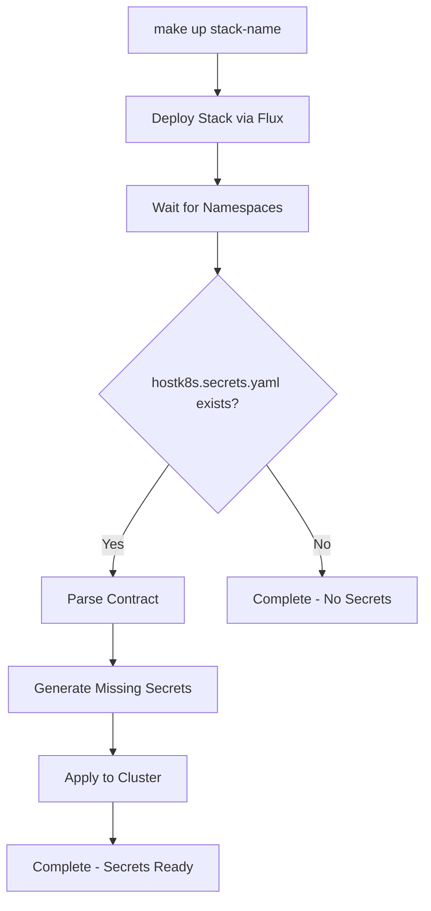

# Secret Contract Specification

## Overview

Secret contracts allow stacks to declare their secret requirements without storing any sensitive data in git. Secrets are generated automatically during stack deployment and exist only in the Kubernetes cluster.

## Contract Schema

### File Location
Secret contracts must be named `hostk8s.secrets.yaml` and placed in the stack directory:
```
software/stacks/{stack-name}/hostk8s.secrets.yaml
```

### Schema Definition

```yaml
apiVersion: hostk8s.io/v1
kind: SecretContract
metadata:
  name: {stack-name}
spec:
  secrets:
    - name: {secret-name}
      namespace: {namespace}
      data:
        - key: {field-name}
          value: {static-value}        # For static values
          generate: {generation-type}  # For generated values
          length: {length}             # Optional, for generated values
```

## Data Field Types

The generic `data` format supports both static values and generated secrets:

### Static Values
```yaml
data:
  - key: username
    value: postgres
  - key: database
    value: voting
  - key: host
    value: voting-db-rw.sample-app.svc.cluster.local
  - key: port
    value: "5432"
```

### Generated Values

| Type | Character Set | Default Length | Example | Use Case |
|------|---------------|----------------|---------|----------|
| `password` | A-Z, a-z, 0-9, `!@#$%^&*` | 32 | `A1b2C3!@#$%^&*Xy9Z` | Database passwords, secure authentication |
| `token` | A-Z, a-z, 0-9 | 32 | `A1b2C3d4E5f6G7h8I9j0K1l2` | API tokens, session keys, safe identifiers |
| `hex` | a-f, 0-9 | 32 | `a1b2c3d4e5f6789012345678` | Encryption keys, hash values, hex IDs |
| `uuid` | Standard UUID v4 | Fixed (36) | `550e8400-e29b-41d4-a716-446655440000` | Correlation IDs, unique identifiers |

**Notes:**
- All generation uses cryptographically secure random sources
- Length is configurable for `password`, `token`, and `hex` types (minimum 8 for passwords)
- UUID length is always 36 characters (RFC 4122 standard)
- Generated values are unique per secret generation

```yaml
data:
  - key: password
    generate: password
    length: 32
  - key: api_token
    generate: token
    length: 64
  - key: session_id
    generate: hex
    length: 16
  - key: correlation_id
    generate: uuid
```

**Default Length**: 32 characters (configurable via `length` field)
**Security**: All generated values use cryptographically secure random generation

## Complete Example

```yaml
apiVersion: hostk8s.io/v1
kind: SecretContract
metadata:
  name: sample-app
spec:
  secrets:
    # PostgreSQL database credentials
    - name: postgres-credentials
      namespace: sample-app
      data:
        - key: username
          value: postgres
        - key: password
          generate: password
          length: 8
        - key: database
          value: voting
        - key: host
          value: voting-db-rw.sample-app.svc.cluster.local
        - key: port
          value: "5432"

    # Application secrets
    - name: app-secrets
      namespace: sample-app
      data:
        - key: jwt_secret
          generate: token
          length: 64
        - key: session_key
          generate: password
          length: 32
        - key: api_key
          generate: hex
          length: 40
        - key: correlation_id
          generate: uuid
        - key: environment
          value: development
```

## Generated Secret Format

All generated secrets follow Kubernetes Secret conventions:

```yaml
apiVersion: v1
kind: Secret
metadata:
  name: {secret-name}
  namespace: {namespace}
  labels:
    hostk8s.io/managed: "true"
    hostk8s.io/contract: "{stack-name}"
type: Opaque
stringData:
  {field}: {value}
```

## Usage in Deployments

Reference generated secrets normally in your deployments:

```yaml
# PostgreSQL connection using individual fields
env:
  - name: POSTGRES_HOST
    valueFrom:
      secretKeyRef:
        name: postgres-credentials
        key: host
  - name: POSTGRES_USER
    valueFrom:
      secretKeyRef:
        name: postgres-credentials
        key: username
  - name: POSTGRES_PASSWORD
    valueFrom:
      secretKeyRef:
        name: postgres-credentials
        key: password
  - name: POSTGRES_DB
    valueFrom:
      secretKeyRef:
        name: postgres-credentials
        key: database

# Application secrets
env:
  - name: JWT_SECRET
    valueFrom:
      secretKeyRef:
        name: app-secrets
        key: jwt_secret
```

## Validation Rules

| Category | Field | Requirement | Details |
|----------|-------|-------------|----------|
| **Contract** | `name` | Required | Valid Kubernetes resource name (DNS-1123 subdomain) |
| **Contract** | `namespace` | Required | Must exist or be created by stack deployment |
| **Contract** | `data` | Required | At least one data field must be defined |
| **Data Field** | `key` | Required | Valid Kubernetes secret key name (alphanumeric, dash, underscore) |
| **Data Field** | `value` or `generate` | Required | Must specify one (mutually exclusive) |
| **Generation** | `generate` | Optional | One of: `password`, `token`, `hex`, `uuid` |
| **Generation** | `length` | Optional | Minimum 8 for passwords, ignored for UUID |

### Field Constraints

> **⚠️ Length Limits**: Maximum field name length is 63 characters (Kubernetes limit)
> **🔒 Password Security**: Minimum password length is 8 characters
> **🏷️ Key Format**: Secret keys support alphanumeric, dash, and underscore only

## Security Considerations

| Aspect | Implementation | Benefit |
|--------|----------------|----------|
| **Git Security** | Generated secrets never written to repository | 🔒 No sensitive data in version control |
| **Cluster Isolation** | Secrets exist only in Kubernetes cluster | 🏰 Runtime-only secret storage |
| **Ephemeral Generation** | Regenerated on fresh deployments only | ♻️ Fresh secrets per environment |
| **Environment Separation** | Different secrets per cluster/environment | 🎯 Isolated secret contexts |
| **Audit Trail** | All secrets labeled with contract source | 📋 Traceable secret provenance |
| **Idempotency** | Existing secrets preserved during updates | 🔄 Stable secret lifecycle |

### Security Best Practices

> **✅ Recommended**: Use `password` type for authentication credentials
> **✅ Recommended**: Use `token` type for API keys and session identifiers
> **✅ Recommended**: Use `hex` type for encryption keys and hash values
> **✅ Recommended**: Use `uuid` type for correlation and tracking IDs

## Integration with Make

Secret contracts are automatically processed during stack deployment:

```bash
make up {stack-name}  # Deploys stack and generates secrets if hostk8s.secrets.yaml exists
```

### Automatic Generation Workflow

Secret generation happens automatically as part of `make up <stack>` when a `hostk8s.secrets.yaml` file exists:



| Step | Action | Details |
|------|--------|---------|
| 1 | **Deploy Stack** | Flux deploys manifests and creates namespaces |
| 2 | **Wait for Namespaces** | 60-second timeout for namespace readiness |
| 3 | **Parse Contract** | Read and validate `hostk8s.secrets.yaml` |
| 4 | **Generate Secrets** | Create only missing secrets (idempotent) |
| 5 | **Apply to Cluster** | Use `kubectl apply` to create secrets |

### Troubleshooting

If secrets are not generating as expected:

1. **Check Contract Syntax**: Validate your `hostk8s.secrets.yaml` with `yq`
2. **Verify Namespace**: Ensure the target namespace exists after stack deployment
3. **Review Logs**: Check stack deployment logs for any Flux reconciliation issues
4. **Force Regeneration**: Delete the entire namespace and redeploy with `make up <stack>`

#### Debugging Secret Values

To verify generated secret contents during troubleshooting:

```bash
# View all keys in a secret
kubectl get secret {secret-name} -n {namespace} -o jsonpath='{.data}' | jq

# Decode a specific secret value
kubectl get secret {secret-name} -n {namespace} -o jsonpath='{.data.{key}}' | base64 -d

# View all secrets with labels (HostK8s managed secrets)
kubectl get secrets -n {namespace} -l hostk8s.io/managed=true

# Example: Check postgres password
kubectl get secret postgres-credentials -n sample-app -o jsonpath='{.data.password}' | base64 -d
```

> **🔄 Regeneration**: Secrets automatically regenerate when missing - delete the namespace for a complete reset
> **⚠️ Security**: Only decode secret values in secure environments for debugging purposes
