# Secret Contract Specification

## Overview

Secret contracts allow stacks to declare their secret requirements without storing any sensitive data in git. Secrets are generated automatically during stack deployment, stored in HashiCorp Vault, and synced to Kubernetes via the External Secrets Operator (ESO).

## Contract Schema

### File Location
Secret contracts must be named `hostk8s.secrets.yaml` and placed in the stack directory:
```
software/stacks/{stack-name}/hostk8s.secrets.yaml
```

### Schema Definition

```yaml
apiVersion: hostk8s.io/v1
kind: SecretContract
metadata:
  name: {stack-name}
spec:
  secrets:
    - name: {secret-name}
      namespace: {namespace}
      data:
        - key: {field-name}
          value: {static-value}        # For static values
          generate: {generation-type}  # For generated values
          length: {length}             # Optional, for generated values
```

## Data Field Types

The generic `data` format supports both static values and generated secrets:

### Static Values
```yaml
data:
  - key: username
    value: postgres
  - key: database
    value: voting
  - key: host
    value: voting-db-rw.sample-app.svc.cluster.local
  - key: port
    value: "5432"
```

### Generated Values

| Type | Character Set | Default Length | Example | Use Case |
|------|---------------|----------------|---------|----------|
| `password` | A-Z, a-z, 0-9, `!@#$%^&*` | 32 | `A1b2C3!@#$%^&*Xy9Z` | Database passwords, secure authentication |
| `token` | A-Z, a-z, 0-9 | 32 | `A1b2C3d4E5f6G7h8I9j0K1l2` | API tokens, session keys, safe identifiers |
| `hex` | a-f, 0-9 | 32 | `a1b2c3d4e5f6789012345678` | Encryption keys, hash values, hex IDs |
| `uuid` | Standard UUID v4 | Fixed (36) | `550e8400-e29b-41d4-a716-446655440000` | Correlation IDs, unique identifiers |

**Notes:**
- All generation uses cryptographically secure random sources
- Length is configurable for `password`, `token`, and `hex` types (minimum 8 for passwords)
- UUID length is always 36 characters (RFC 4122 standard)
- Generated values are unique per secret generation

```yaml
data:
  - key: password
    generate: password
    length: 32
  - key: api_token
    generate: token
    length: 64
  - key: session_id
    generate: hex
    length: 16
  - key: correlation_id
    generate: uuid
```

**Default Length**: 32 characters (configurable via `length` field)
**Security**: All generated values use cryptographically secure random generation

## Complete Example

```yaml
apiVersion: hostk8s.io/v1
kind: SecretContract
metadata:
  name: sample-app
spec:
  secrets:
    # PostgreSQL database credentials
    - name: postgres-credentials
      namespace: sample-app
      data:
        - key: username
          value: postgres
        - key: password
          generate: password
          length: 8
        - key: database
          value: voting
        - key: host
          value: voting-db-rw.sample-app.svc.cluster.local
        - key: port
          value: "5432"

    # Application secrets
    - name: app-secrets
      namespace: sample-app
      data:
        - key: jwt_secret
          generate: token
          length: 64
        - key: session_key
          generate: password
          length: 32
        - key: api_key
          generate: hex
          length: 40
        - key: correlation_id
          generate: uuid
        - key: environment
          value: development
```

## Architecture: Vault + External Secrets Operator

The secret management architecture uses HashiCorp Vault as the backend storage with External Secrets Operator syncing to Kubernetes:

### Vault Storage
Secrets are stored in Vault's KV v2 engine at path: `secret/{stack}/{namespace}/{secret-name}`

Example Vault storage:
```bash
# Path: secret/sample-app/sample-app/postgres-credentials
{
  "username": "postgres",
  "password": "A1b2C3!@#$%^&*Xy9Z",
  "database": "voting",
  "host": "voting-db-rw.sample-app.svc.cluster.local",
  "port": "5432"
}
```

### ExternalSecret Manifests
Generated ExternalSecret manifests sync Vault secrets to Kubernetes:

```yaml
apiVersion: external-secrets.io/v1
kind: ExternalSecret
metadata:
  name: {secret-name}
  namespace: {namespace}
  labels:
    hostk8s.io/managed: "true"
    hostk8s.io/contract: "{stack-name}"
spec:
  refreshInterval: 1h
  secretStoreRef:
    name: vault-backend
    kind: ClusterSecretStore
  target:
    name: {secret-name}
    creationPolicy: Owner
  data:
  - secretKey: {key}
    remoteRef:
      key: {stack}/{namespace}/{secret-name}
      property: {key}
```

### Resulting Kubernetes Secret
External Secrets Operator creates the final Kubernetes secret:

```yaml
apiVersion: v1
kind: Secret
metadata:
  name: {secret-name}
  namespace: {namespace}
  labels:
    hostk8s.io/managed: "true"
    hostk8s.io/contract: "{stack-name}"
type: Opaque
data:
  {field}: {base64-encoded-value}
```

## Usage in Deployments

Reference generated secrets normally in your deployments:

```yaml
# PostgreSQL connection using individual fields
env:
  - name: POSTGRES_HOST
    valueFrom:
      secretKeyRef:
        name: postgres-credentials
        key: host
  - name: POSTGRES_USER
    valueFrom:
      secretKeyRef:
        name: postgres-credentials
        key: username
  - name: POSTGRES_PASSWORD
    valueFrom:
      secretKeyRef:
        name: postgres-credentials
        key: password
  - name: POSTGRES_DB
    valueFrom:
      secretKeyRef:
        name: postgres-credentials
        key: database

# Application secrets
env:
  - name: JWT_SECRET
    valueFrom:
      secretKeyRef:
        name: app-secrets
        key: jwt_secret
```

## Validation Rules

| Category | Field | Requirement | Details |
|----------|-------|-------------|----------|
| **Contract** | `name` | Required | Valid Kubernetes resource name (DNS-1123 subdomain) |
| **Contract** | `namespace` | Required | Must exist or be created by stack deployment |
| **Contract** | `data` | Required | At least one data field must be defined |
| **Data Field** | `key` | Required | Valid Kubernetes secret key name (alphanumeric, dash, underscore) |
| **Data Field** | `value` or `generate` | Required | Must specify one (mutually exclusive) |
| **Generation** | `generate` | Optional | One of: `password`, `token`, `hex`, `uuid` |
| **Generation** | `length` | Optional | Minimum 8 for passwords, ignored for UUID |

### Field Constraints

> **⚠️ Length Limits**: Maximum field name length is 63 characters (Kubernetes limit)
> **🔒 Password Security**: Minimum password length is 8 characters
> **🏷️ Key Format**: Secret keys support alphanumeric, dash, and underscore only

## Security Considerations

| Aspect | Implementation | Benefit |
|--------|----------------|----------|
| **Git Security** | Generated secrets never written to repository | 🔒 No sensitive data in version control |
| **Cluster Isolation** | Secrets exist only in Kubernetes cluster | 🏰 Runtime-only secret storage |
| **Ephemeral Generation** | Regenerated on fresh deployments only | ♻️ Fresh secrets per environment |
| **Environment Separation** | Different secrets per cluster/environment | 🎯 Isolated secret contexts |
| **Audit Trail** | All secrets labeled with contract source | 📋 Traceable secret provenance |
| **Idempotency** | Existing secrets preserved during updates | 🔄 Stable secret lifecycle |

### Security Best Practices

> **✅ Recommended**: Use `password` type for authentication credentials
> **✅ Recommended**: Use `token` type for API keys and session identifiers
> **✅ Recommended**: Use `hex` type for encryption keys and hash values
> **✅ Recommended**: Use `uuid` type for correlation and tracking IDs

## Integration with Make

Secret contracts are automatically processed during stack deployment:

```bash
make up {stack-name}  # Deploys stack and processes secrets if hostk8s.secrets.yaml exists
```

### Enhanced Vault+ESO Workflow

The current architecture integrates Vault storage with GitOps deployment:

```mermaid
graph TD
    A[make up stack-name] --> B[manage-secrets.py add stack]
    B --> C[Store secrets in Vault KV]
    B --> D[Generate external-secrets.yaml]
    A --> E[Flux deploys stack]
    D --> E
    E --> F[ESO syncs Vault → K8s]
    C --> F
    F --> G[Kubernetes Secrets ready]
```



| Step | Action | Details |
|------|--------|---------|
| 1 | **Process Secret Contract** | `manage-secrets.py` parses `hostk8s.secrets.yaml` |
| 2 | **Store in Vault** | Generated secrets stored in Vault KV v2 at `secret/{stack}/{namespace}/{secret-name}` |
| 3 | **Generate ESO Manifests** | Create `external-secrets.yaml` for GitOps deployment |
| 4 | **Deploy Stack** | Flux deploys stack manifests including ExternalSecret resources |
| 5 | **Sync to Kubernetes** | External Secrets Operator pulls from Vault and creates K8s secrets |

### Command Interface

Enhanced secret lifecycle management:

```bash
# Automatically called by make up
manage-secrets.py add {stack-name}     # Store in Vault + generate manifests

# Manual lifecycle operations
manage-secrets.py remove {stack-name}  # Remove from Vault
manage-secrets.py list [stack-name]    # List stored secrets
```

### Troubleshooting

#### Vault + ESO Troubleshooting

If secrets are not available in Kubernetes:

1. **Check Vault Storage**: Verify secrets are stored in Vault
2. **Check ESO Status**: Ensure External Secrets Operator is functioning
3. **Check ExternalSecret Resources**: Verify ExternalSecret manifests are deployed
4. **Check Contract Syntax**: Validate your `hostk8s.secrets.yaml` with `yq`

#### Debugging Commands

**Vault Secret Inspection:**
```bash
# List secrets in Vault for a stack
manage-secrets.py list sample-app

# Access Vault UI for visual inspection
open http://localhost:8080/ui/vault
# Login token: hostk8s
```

**External Secrets Operator Status:**
```bash
# Check ExternalSecret resources
kubectl get externalsecrets -n {namespace}

# Check ExternalSecret status and sync
kubectl describe externalsecret {secret-name} -n {namespace}

# Check ESO controller logs
kubectl logs -n hostk8s -l app.kubernetes.io/name=external-secrets
```

**Kubernetes Secret Verification:**
```bash
# View all keys in a secret
kubectl get secret {secret-name} -n {namespace} -o jsonpath='{.data}' | jq

# Decode a specific secret value
kubectl get secret {secret-name} -n {namespace} -o jsonpath='{.data.{key}}' | base64 -d

# View all managed secrets
kubectl get secrets -n {namespace} -l hostk8s.io/managed=true

# Example: Check postgres password
kubectl get secret postgres-credentials -n sample-app -o jsonpath='{.data.password}' | base64 -d
```

#### Common Issues

| Issue | Symptoms | Resolution |
|-------|----------|------------|
| **Vault not accessible** | ESO can't sync secrets | Check Vault addon is running: `make status` |
| **ExternalSecret not deployed** | No K8s secrets created | Ensure `external-secrets.yaml` is committed to Git |
| **ESO permission issues** | ESO can't access Vault | Check ClusterSecretStore configuration |
| **Namespace timing** | ExternalSecret deployed before namespace | Flux handles sequencing automatically |

> **🔄 Complete Reset**: Run `make down {stack}` then `make up {stack}` for full secret regeneration
> **🔍 Debug Access**: Use Vault UI at `http://localhost:8080/ui/vault` (token: `hostk8s`) for visual secret inspection
> **⚠️ Security**: Only decode secret values in secure environments for debugging purposes
